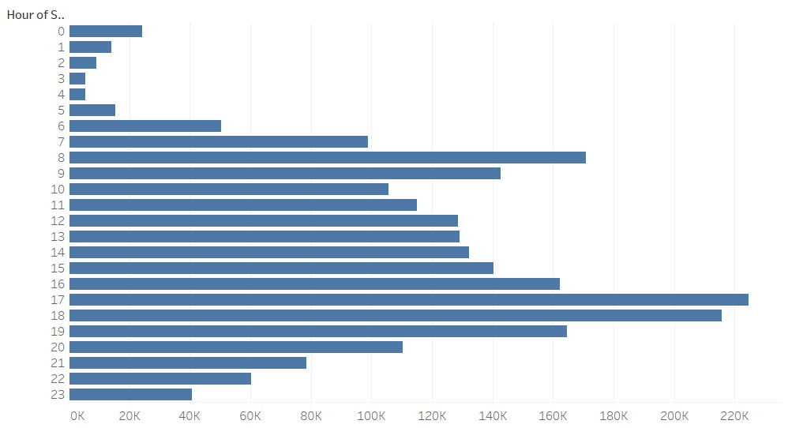
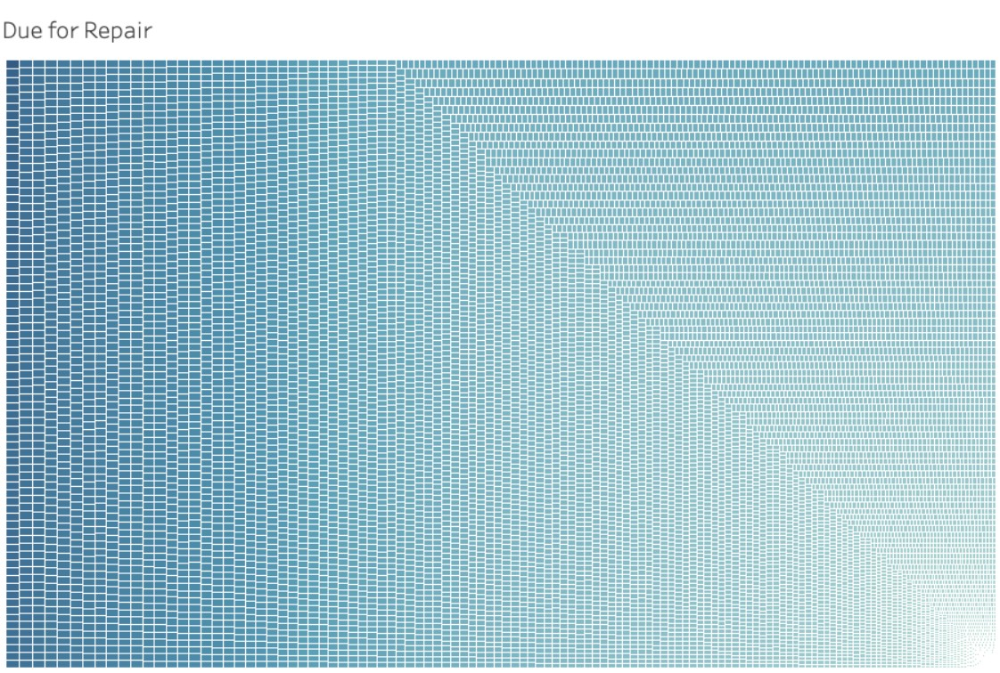
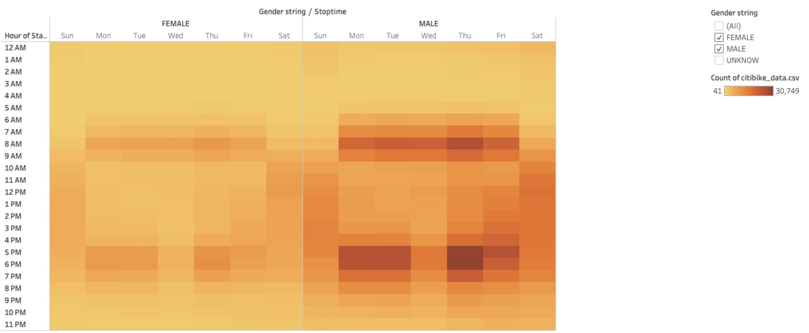
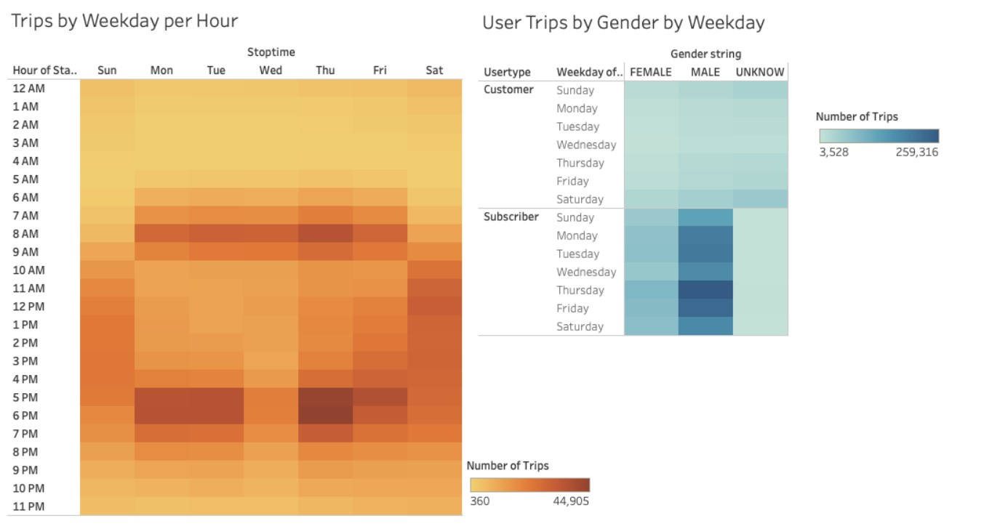

# NYC Bikesharing 2019
## Overview
### The project is an analysis of how Citi Bike has fared over seasons in New York City during 2019. Using Tableau, we can find peak seasons, peak hours, gender breakdowns, and many other components of Citi Bike data.  
## Results
### By creating a visualization story using Tableau, we can go step by step in analyzing our data and making our conclusions in a clean and user-friendly way. 

* August is peak season for citi bikes. Within that month, citi bikes are in use the most between the hours of 5:00 pm to 7:00 pm.

* Bike repairs will be needed most for bike that are in use the most. The best time for repairs would be between the hours of 2:00 am to 5:00 am.

* Men checkout Citi Bikes longer than women. 

## Trips by weekday per hour and gender using heatmaps

## Summary
### Citi Bikes are extremely popular in metropolitan areas. A perfect example of this is the NYC data consisting of 2,344,224 riders during the month of August. Using the data we have concluded that men rent citibikes for longer hours than women. Even though this is the case, the peak riding hours are the unchanging for both genders, possibly because these rides are an alternative to public transport systems since the highest uses are during the mornings and evenings. Two additional visualizations I would perform on this data would be to explore the starting and ending locations and how they fare to local traffic. I would also explore how different seasons compare to each other such as summer, winter, fall, and spring, and whether there is a trend between the changing of the seasons compared to citi bike checkouts. 
